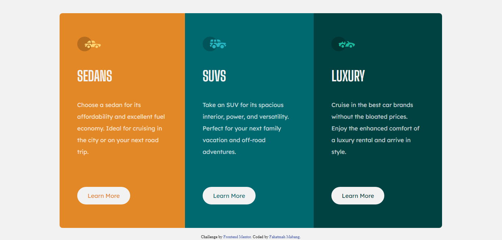

# 3-Column-Preview-Card

### Screenshot

### Built with

- Semantic HTML5 markup
- CSS custom properties
- Flexbox
- CSS Grid

### What I learned

I always want my layout to be responsive so whenever I am going to start, I use rem or percentage.
